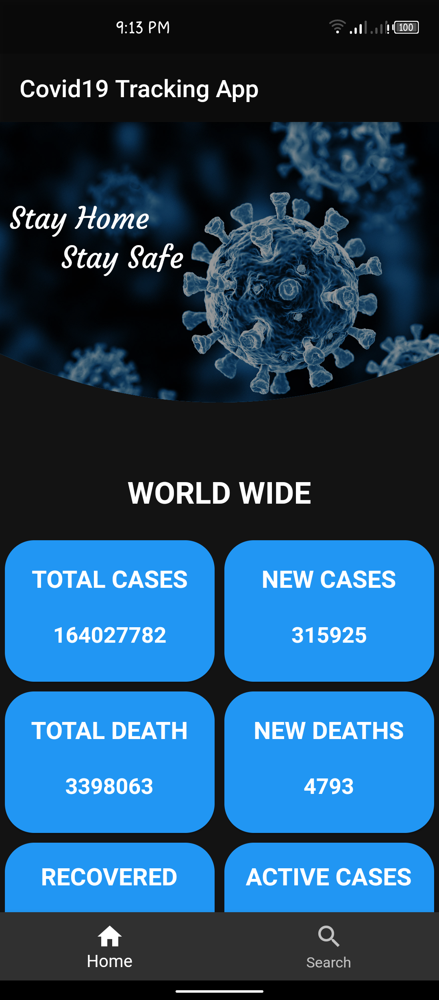
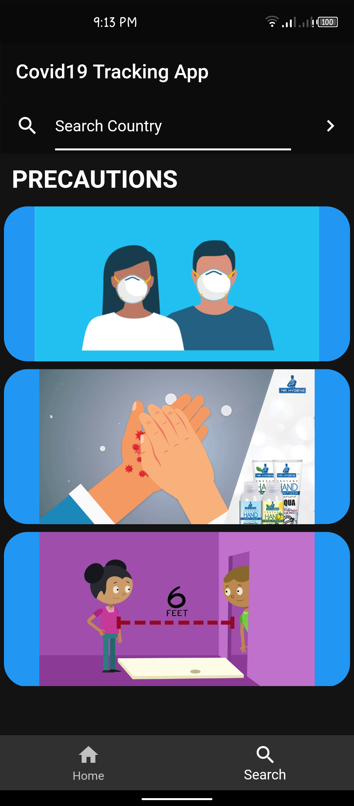
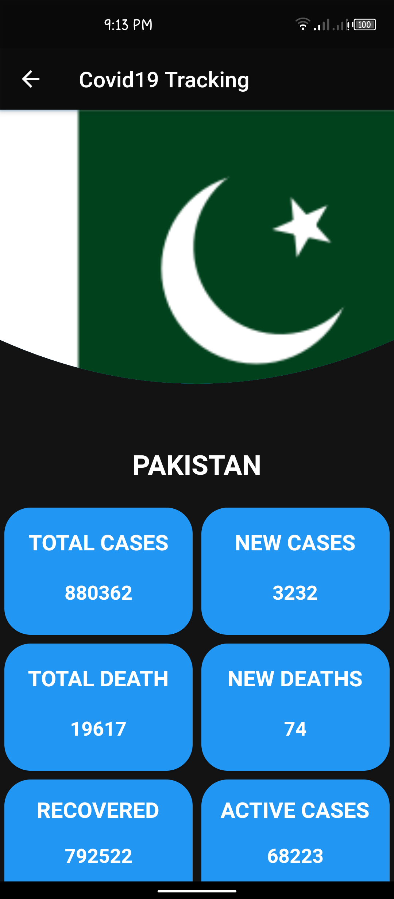

## Flutter-COVID19-Tracking-App

### INTRODUCTION

In this pandemic, we need to be aware about the situation of COVID. So this app will tell you about the cases report in previous 24 hours. The results or information in this app would be refresh after every 10 minutes.  For creating this APP I use API.
You can take a look for the API https://corona.lmao.ninja/docs/ .

### SCREENSHOTS

This is the home page where you can get all the information about world wide situation of COVID19.

This is the search tab where you are informed with some precautions and a search option to search for a specific country.

Lets say we search for Pakistan, so we get all the information for Pakistan for previous 24 hours. you get a flag and country name which indicate that what country you search.

### GENERATE APK

To generate APK file first clone the repository and open terminal and navigate to the covid19_ folder and write the following command:

flutter build apk

By run this command you have new folder named build in covid19_ project. navigate to
build/app/outputs/apk/release/

here you have apk file 

install this apk on your android phone and enjoy!!!

